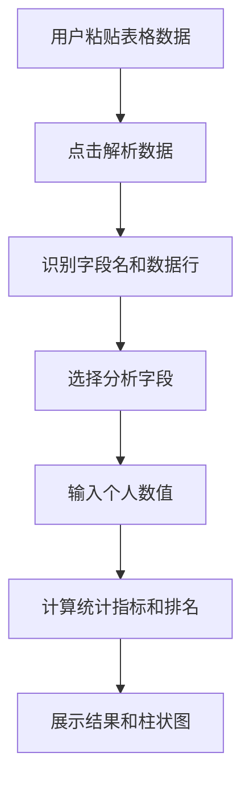

## 1. 产品概述

一个极简的成绩数据分析工具，用户粘贴表格数据后即可快速了解自己在群体中的位置。无需登录、无需数据库，纯前端运行。

## 2. 核心功能

### 2.1 功能模块

1. **数据录入模块**：大文本框粘贴表格数据，支持 Tab/逗号/多空格分隔，点击"解析数据"后识别字段名、显示数据行数
2. **统计分析模块**：选择字段后输入个人数值，计算最高/最低/平均/中位数/分位数等统计指标
3. **排名定位模块**：计算用户输入值在群体中的排名位置、超过百分比
4. **可视化模块**：柱状图展示字段分布情况

### 2.2 页面详情

| 页面名称 | 模块名称 | 功能描述 |
|----------|----------|----------|
| 主页 | 数据输入区 | 多行文本框粘贴数据，解析按钮 |
| 主页 | 字段选择区 | 下拉框选择分析字段，输入个人数值 |
| 主页 | 统计结果区 | 显示最高/最低/平均/中位数/各分位数 |
| 主页 | 排名定位区 | 显示排名区间、超过百分比、与平均值/中位数对比 |
| 主页 | 分布图表区 | 柱状图展示数据分布 |

## 3. 核心流程

## 4. 用户界面设计

### 4.1 设计风格

- 极简主义设计，干净清晰的数据展示
- 主色调：深蓝（数据专业感）+ 白色背景 + 浅灰辅助色
- 卡片式布局，圆角设计
- 使用清晰的无衬线字体，数字使用等宽字体
- 响应式布局，适配不同屏幕尺寸

### 4.2 页面设计概览

| 页面名称 | 模块名称 | UI 元素 |
|----------|----------|----------|
| 主页 | 数据输入区 | 大文本框 + 解析按钮，简洁样式 |
| 主页 | 统计结果区 | 卡片网格展示各项统计指标 |
| 主页 | 排名定位区 | 高亮显示排名信息，使用颜色区分高低 |
| 主页 | 分布图表区 | 简洁柱状图，使用 CSS 实现 |

### 4.3 响应式

桌面端优先设计，移动端自适应，保持布局清晰可读。
