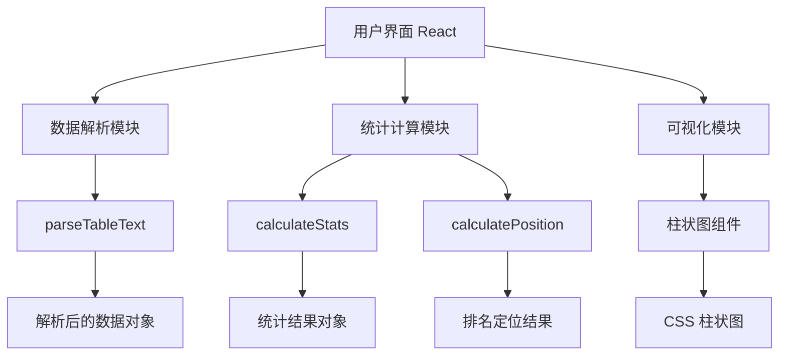

## 1. 架构设计



## 2. 技术说明

- 前端：React 18 + TypeScript + Vite
- 初始化工具：create vite-init
- 后端：无
- 数据库：无
- 样式：CSS Modules / 内联样式，保持简单
- 图表：纯 CSS 实现柱状图

## 3. 路由定义

| 路由 | 用途 |
|------|------|
| / | 主页，包含所有功能模块 |

## 4. 数据模型

### 4.1 数据结构定义

```typescript
// 解析后的表格数据
interface ParsedTable {
  headers: string[];
  rows: Record<string, string>[];
}

// 统计结果
interface StatsResult {
  count: number;
  max: number;
  min: number;
  mean: number;
  median: number;
  q25: number;
  q75: number;
  q90: number;
  q95: number;
}

// 排名定位结果
interface PositionResult {
  total: number;
  higherCount: number;
  equalCount: number;
  lowerCount: number;
  bestRank: number;
  worstRank: number;
  estimatedRank: number;
  percentile: number;
  existsInData: boolean;
}
```

## 5. 核心函数定义

### 5.1 calculateStats

计算字段的统计指标，包括最高、最低、平均、中位数、各分位数。

### 5.2 calculatePosition

计算用户输入值在群体中的排名位置，包括排名区间、超过百分比等。

### 5.3 parseTableText

解析用户粘贴的表格文本，支持 Tab、逗号、多空格分隔。
