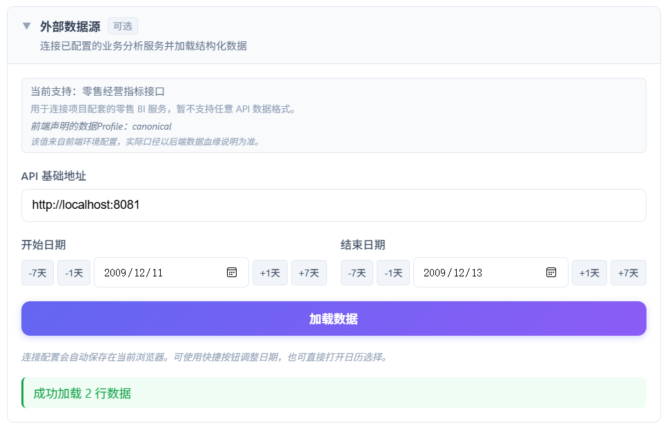
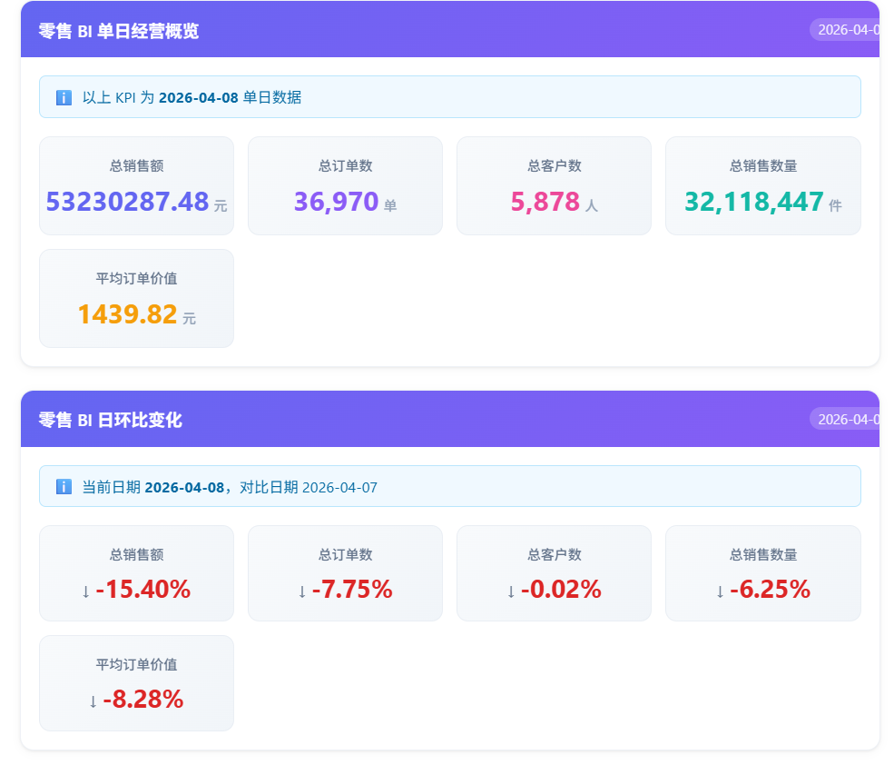

# 表格数据分析工具

一个基于 React、TypeScript 和 ECharts 构建的浏览器端表格数据分析平台。

平台支持粘贴表格、上传 CSV / Excel、加载示例数据，以及通过可选的外部数据源加载结构化业务数据。数据进入平台后，会经过统一的表格模型、字段识别和分析链路，生成描述统计、相对位置、筛选、分组、关系分析、异常值分析和可视化结果。

当前版本：`v2.2.1`

## 在线体验

- 主站（Cloudflare Worker）：`https://datainsightkit.com/`
- GitHub Pages：`https://2026heita.github.io/score-analysis-tool/`

## 项目定位

本项目最初用于成绩数据分析，现已逐步升级为通用表格数据分析平台。

当前主分析链路不再依赖固定的“学生、成绩、排名”字段，而是根据数据内容识别：

- 数值字段
- 分类字段
- 时间字段
- 标识字段
- 文本与描述字段

教育场景相关能力仍作为兼容功能保留，但平台的主要目标是支持销售额、订单数、客户数、访问量、成本、耗时等更通用的业务数据。

## 核心能力

### 多种数据入口

- 直接粘贴表格文本
- 上传 CSV 文件
- 上传 Excel 文件
- Excel 多工作表切换
- 加载内置示例数据
- 从可选的外部业务服务加载结构化数据

粘贴文本和 CSV 数据要求第一行为字段名，后续每行为数据。

### 字段识别与数据概览

平台会自动识别字段的数据类型和分析角色，并展示：

- 数据行数与字段数量
- 数值、分类、时间等字段分布
- 字段识别结果与判断依据
- 有效值、缺失值和基础统计
- 数据解析警告与异常情况

### 描述统计

数值字段可查看：

- 有效记录数与缺失记录数
- 最小值与最大值
- 平均值与中位数
- 四分位数
- 标准差
- 异常值数量

### 相对位置分析

平台不会默认把所有数值字段解释为“越高越好”。

用户可以为当前字段选择：

- 使用字段默认方向
- 数值越高，位置越靠前
- 数值越低，位置越靠前

只有字段具有明确方向时，平台才会计算：

- 高于、等于和低于参考值的记录数
- 相对位置区间
- 不存在值的估算相对位置
- 百分位结果

未指定方向的字段只展示统计分布，避免产生误导性的优劣评价。

### 数据筛选与异常值处理

- 按数值字段设置筛选条件
- 筛选结果同步影响统计、图表和导出
- 查看异常值记录
- 排除或恢复异常值
- 无数据时提供明确提示

### 分组分析

选择分类字段后，可以按组查看：

- 记录数
- 平均值
- 中位数
- 最小值与最大值
- 分组对比图

分组结果可以导出为 CSV。

### 变量关系分析

当数据中存在至少两个可分析数值字段时，平台会计算 Pearson 相关系数，并展示：

- 强正相关字段对
- 强负相关字段对
- 低相关字段对
- 相关性矩阵

相关性只表示统计关系，不代表因果关系。

### 时间趋势分析

当平台识别到时间字段时，会自动显示“时间趋势”图表。

时间趋势支持：

- 按时间排序
- 在不同数值字段之间切换
- 保留原始日期与完整数值 Tooltip
- 跳过无效日期
- 将无效数值保留为空值断点
- 保留重复日期记录，不在前端静默聚合

### 图表分析

当前主要图表包括：

- 分布图（直方图）
- 箱线图
- 累积分布图（CDF）
- 四分位占比图
- 时间趋势折线图
- 分组柱状图
- 原始字段雷达分析
- 相关性矩阵

图表已针对窄屏设备进行适配，标签页支持换行，主要 Tooltip 和坐标轴也进行了防裁切处理。

### 数据导出

支持导出：

- 筛选后的原始数据 CSV
- 分组分析结果 CSV
- 当前指标摘要 CSV

指标摘要使用 UTF-8 BOM，便于在常见表格软件中直接打开中文内容。

## 外部数据源

平台当前提供一个可选的零售 BI 数据连接器，用于连接项目配套的 Spring Boot 指标服务。

当前支持的接口：

- `GET {baseUrl}/api/v1/dashboard/overview/trend?startDate=...&endDate=...`
- `GET {baseUrl}/api/v1/dashboard/overview?date=...`
- `GET {baseUrl}/api/v1/dashboard/overview/comparison?date=...`

说明：

- 趋势接口使用开始日期和结束日期；
- 单日概览与日环比使用结束日期作为查询日期；
- 重新加载时会清理上一轮的概览、环比和经营异常结果；概览、环比或经营异常请求失败不会影响已经成功加载的趋势数据。

示例请求（canonical 主案例）：

```text
GET {baseUrl}/api/v1/dashboard/overview/trend
    ?startDate=2009-12-11
    &endDate=2009-12-13
```

该日期范围包含两个真实业务日期：2009-12-11 和 2009-12-13（2009-12-12 无业务数据）。

预期响应结构：

```json
{
  "code": 200,
  "message": "success",
  "data": [
    {
      "dt": "2009-12-11",
      "totalSales": 39388.54,
      "totalOrders": 65,
      "totalCustomers": 58,
      "totalQuantity": 21276,
      "avgOrderValue": 605.98,
      "sourceSystem": "retail_canonical_ads"
    },
    {
      "dt": "2009-12-13",
      "totalSales": 21711.46,
      "totalOrders": 69,
      "totalCustomers": 63,
      "totalQuantity": 12293,
      "avgOrderValue": 314.66,
      "sourceSystem": "retail_canonical_ads"
    }
  ],
  "requestId": "..."
}
```

接口数据会被转换成平台统一的 `ParsedTable`，然后复用现有字段识别、统计、图表和导出流程。

当前连接器只适配项目配套的零售经营指标接口，暂不支持任意 API 响应格式。后续可在统一表格模型之上增加更多连接器。

> 当前 canonical 端到端链路已完成本地联调，主案例为 2009-12-13 与上一可用业务日 2009-12-11 比较。
>
> 历史工程验证：早期版本曾使用 `engineering_legacy_3x` 与 `synthetic_multiday` 验证 API 接入链路，不代表真实业务数据。



> 截图证明内容：
> - 查询范围 2009-12-11 ~ 2009-12-13
> - 成功加载 2 个真实业务日期
> - 当前业务日 2009-12-13
> - 上一可用业务日 2009-12-11
> - 2009-12-12 无业务数据
> - 页面展示五项经营指标及环比
>
> API 验证结果：comparisonAvailable=true，sourceSystem=retail_canonical_ads（来自后端 API 响应，非截图直接展示）。

### 可选环境变量

可以通过 Vite 环境变量设置默认 API 地址和数据 profile：

```env
VITE_RETAIL_BI_API_BASE_URL=
VITE_RETAIL_DATA_PROFILE=
```

未配置环境变量时：
- API 地址输入框保持为空，不会自动请求 `localhost`
- 数据 profile 显示为"未声明"

配置 `VITE_RETAIL_DATA_PROFILE` 后，连接器区域会显示当前使用的数据 profile，便于追溯数据来源和口径。

**数据 Profile 说明：**

当前页面展示的"数据Profile"来自前端构建环境变量 `VITE_RETAIL_DATA_PROFILE`，仅用于声明当前部署期望连接的数据口径，并不代表后端API已返回或自动验证了该Profile。

允许值：
- `canonical`
- `engineering_legacy_3x`
- `synthetic_multiday`

未配置时显示"未声明"，非法值显示"配置无效"。实际数据口径应以后端数据血缘文档和部署环境为准。

**截图与示例说明：**

当前主案例已更新为 canonical 数据（2009-12-13 与上一可用业务日 2009-12-11 比较）。历史截图仍保留 `engineering_legacy_3x` 与 `synthetic_multiday` 的验证结果，用于证明 API 接入和多日趋势链路，不代表真实企业连续经营趋势。

后端需要允许前端站点来源访问对应接口，并正确配置 CORS。

### 展示效果

#### 1. BI Connector 接入成功


> 配置 Spring Boot API 地址和日期范围后，成功加载零售经营指标数据。

#### 2. 单日经营概览与日环比



> 展示总销售额、总订单数、总客户数、总销售数量和平均订单价值，并比较当前业务日与同一 source_system 下上一可用业务日。
>
> 当前实现：2009-12-13 与上一可用业务日 2009-12-11 比较（2009-12-12 无数据）。comparisonDate 完全由后端 API 返回，前端不自行计算上一日期。

#### 3. 多日销售趋势


> 将日期范围指标转换为统一 ParsedTable，复用平台时间趋势分析能力；截图以总销售额为例。

## 数据处理与隐私边界

### 本地数据

以下数据默认在浏览器中处理：

- 粘贴文本
- CSV 文件
- Excel 文件
- 内置示例数据

文件解析、字段识别、统计计算和图表生成主要在前端完成。

用户主动保存的输入和部分设置可能写入当前浏览器的本地存储，不会自动同步到其他设备或浏览器。

### 外部数据源

使用外部数据源时，浏览器会向用户填写或环境变量配置的服务地址发起请求。

平台无法替外部服务承诺数据留存、日志记录或访问控制策略，实际安全边界取决于所连接的服务。

### Retail BI 连接配置本地持久化

Retail BI Connector 自动在当前浏览器保存以下连接配置：

- `baseUrl`：API 基础地址
- `startDate`：开始日期
- `endDate`：结束日期

**Storage Key：** `game-score.retail-bi.connection`

刷新或重新打开页面时自动恢复已保存的配置。

**不会持久化的内容：**
- API 返回的业务数据（overview/comparison 响应）
- 密码或 token
- 服务端不存储这些配置，仅保存在当前浏览器

**环境变量说明：**

可以通过 Vite 环境变量设置默认 API 地址和数据 profile：

```env
VITE_RETAIL_BI_API_BASE_URL=
VITE_RETAIL_DATA_PROFILE=canonical
```

**重要说明：**
- `VITE_RETAIL_DATA_PROFILE` 只是前端声明的期望 profile
- 真正 `sourceSystem` 应以后端 API 返回值为准
- 不要将真实密码、MySQL 地址等敏感配置写入仓库

## 数据量策略

为避免浏览器因超大表格出现明显卡顿，平台采用分层数据量保护：

- `5,000` 行以内：直接进行完整分析
- `5,001–20,000` 行：提示用户确认后，抽样最多 `5,000` 行进行分析
- 超过 `20,000` 行：仅提供有限预览，不生成正式分析结果

抽样或非完整数据可能影响百分位、相对位置、相关性和图表结论，页面会显示相应提示。

## 分析流程

```text
粘贴 / CSV / Excel / 示例数据
                │
                ▼
          ParsedTable
                │
                ▼
       字段类型与角色识别
                │
                ▼
        AnalysisDataset
                │
                ▼
统计 / 相对位置 / 筛选 / 分组 / 相关性 / 图表 / 导出
```

外部数据源复用相同分析链路：

```text
零售 BI API
    │
    ▼
零售数据适配器
    │
    ▼
ParsedTable
    │
    ▼
统一分析流程
```

## 技术栈

- React 18
- TypeScript 5.6
- Vite 6
- ECharts 6
- SheetJS `xlsx`
- Web Worker（Excel 文件解析）
- 浏览器 Local Storage

项目当前为前端本地优先架构，没有内置通用后端、用户系统或平台数据库。外部业务数据通过独立连接器按需接入。

## 项目结构

```text
src/
├── components/          # 页面、分析面板与交互组件
│   └── charts/          # ECharts 图表组件
├── data/                # 示例数据、更新公告与页面数据
├── engine/              # 统计、指标、筛选、分组和相关性引擎
├── field-schema/        # 字段类型与分析角色识别
├── hooks/               # 解析、分析调度、筛选、导出等 Hooks
├── metrics/             # 指标注册与定义
├── services/            # 外部 API 客户端和数据适配器
├── types/               # 通用与业务类型定义
├── utils/               # 文件解析、格式化和公共工具
└── workers/             # Excel 解析 Worker

scripts/                 # 自动检查与测试脚本
tests/                   # 集成测试辅助文件
test-data/               # 合成测试数据
docs/                    # 发布和使用文档
```

## 本地开发

### 环境准备

建议使用当前 Node.js LTS 版本和 npm。

### 安装依赖

```bash
npm ci
```

### 启动开发服务器

```bash
npm run dev
```

### 类型检查

```bash
npx tsc --noEmit
```

### 生产构建

```bash
npm run build
```

构建前会自动执行版本一致性检查，确保 `package.json` 版本与最新更新公告版本一致。

生产构建产物位于：

```text
dist/
```

### 本地预览生产构建

```bash
npm run preview
```

## 测试与验收

常用命令：

```bash
# 版本一致性检查
npm run check:version

# 指标摘要导出测试
npm run test:export-analysis

# 分析引擎测试
npm run test:analysis-engine

# 移动端兼容性检查
npm run test:mobile-compatibility

# 综合验收
npm run finalAcceptance

# 完整生产构建
npm run build
```

其他解析、统计、相关性、分组和状态管理测试位于 `scripts/` 目录。

## 版本管理

用户可见版本来源于：

```text
src/data/updateLogs.ts
```

最新公告 `updateLogs[0].version` 同时用于页面页脚版本显示。

构建脚本会通过 `scripts/checkVersionConsistency.mjs` 检查最新公告版本与 `package.json` 是否一致，避免页面版本和发布版本再次失配。

## 当前边界

- 外部数据源目前只支持零售经营指标接口，不是通用 API 调试工具
- 平台不会自动判断所有指标的业务优劣方向
- 相关性不代表因果关系
- 抽样数据和非完整数据可能导致分析结果存在偏差
- 本项目不包含权限、用户体系、通用数据库或任意 API 字段映射配置
- 部分教育场景兼容组件仍保留，但主分析链路已经采用通用数据模型

## 项目用途

本项目用于学习、作品展示和数据分析平台能力验证，重点展示：

- 浏览器端表格解析
- 通用字段识别
- 统计分析与可视化
- 外部业务指标接入
- 时间趋势分析
- 可扩展的数据适配与分析链路